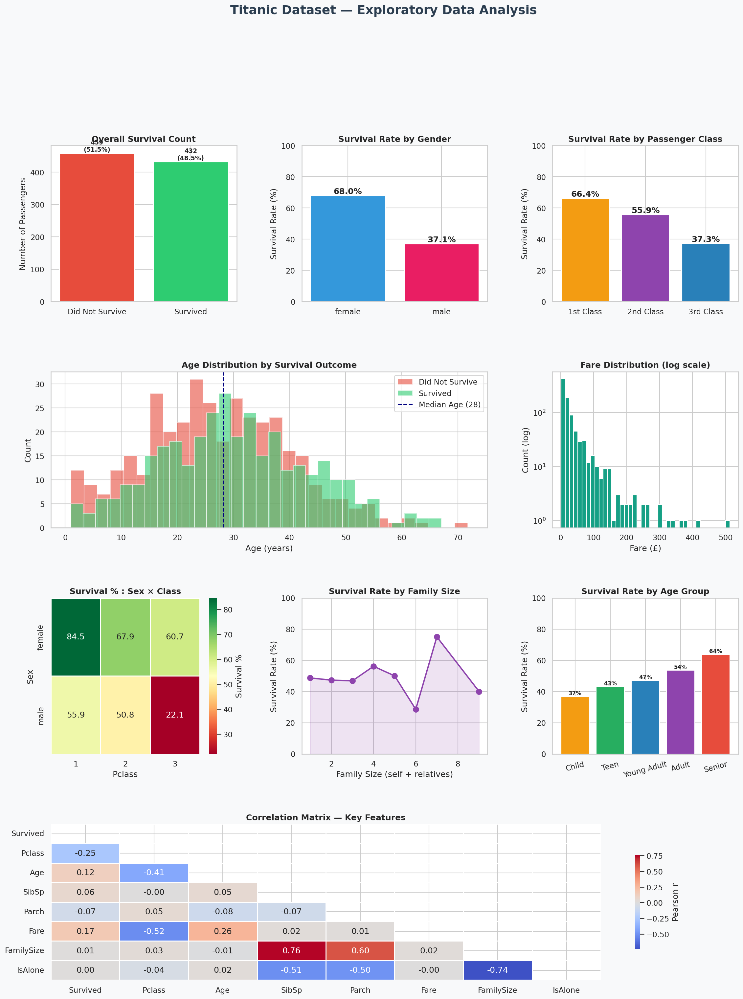

# 🚢 Exploratory Data Analysis (EDA) — Titanic Dataset

> **Project Submission** | Analyze a dataset to uncover patterns and trends.

---

## 📌 Objective

Perform a comprehensive Exploratory Data Analysis on the **Titanic passenger dataset** to uncover survival patterns, correlations, and key influencing factors using statistical summaries and visualizations.

---

## 📂 Project Structure

```
eda-titanic/
├── eda_titanic.py          # Main EDA script
├── eda_visualizations.png  # All charts and plots
├── README.md               # This file
```

---

## 📊 Dataset Overview

| Feature | Description |
|---|---|
| `Survived` | 0 = No, 1 = Yes (Target variable) |
| `Pclass` | Ticket class (1st, 2nd, 3rd) |
| `Sex` | Passenger gender |
| `Age` | Age in years |
| `SibSp` | # of siblings/spouses aboard |
| `Parch` | # of parents/children aboard |
| `Fare` | Passenger fare (£) |
| `Embarked` | Port of Embarkation (S/C/Q) |

- **Total Records:** 891 passengers
- **Missing Values:** ~20% of Age values (imputed using group median)

---

## 🔍 Key Findings

| Insight | Value |
|---|---|
| Overall Survival Rate | 48.5% |
| Female Survival Rate | **68.0%** |
| Male Survival Rate | 37.1% |
| 1st Class Survival Rate | **66.4%** |
| 3rd Class Survival Rate | 37.3% |
| Fare–Survival Correlation | 0.166 |
| Pclass–Survival Correlation | −0.252 |

---

## 📈 Visualizations

The project produces **9 charts** in a single figure:

1. Overall Survival Count (bar)
2. Survival Rate by Gender (bar)
3. Survival Rate by Passenger Class (bar)
4. Age Distribution by Survival Outcome (histogram)
5. Fare Distribution (log scale histogram)
6. Survival Heatmap — Sex × Class
7. Survival Rate by Family Size (line plot)
8. Survival Rate by Age Group (bar)
9. Correlation Matrix — Key Features (heatmap)



---

## 💡 Conclusions

1. **Gender was the strongest survival predictor** — females survived at nearly 2× the rate of males ("women and children first").
2. **Socioeconomic status mattered** — 1st class passengers had a 66% survival rate vs. 37% for 3rd class.
3. **Higher fares correlated positively with survival**, reflecting the class advantage.
4. **Family size had a sweet spot** — passengers with 2–4 family members survived better than solo travelers or very large families.
5. **Age played a role** — though teens and young adults were the most at-risk group due to 3rd class overrepresentation.

---

## 🛠️ Tools & Libraries

- **Python 3.x**
- `pandas` — data manipulation
- `numpy` — numerical operations
- `matplotlib` — plotting
- `seaborn` — statistical visualizations
- `scikit-learn` — preprocessing utilities

---

## ▶️ How to Run

```bash
# Clone the repo
git clone https://github.com/YOUR_USERNAME/eda-titanic.git
cd eda-titanic

# Install dependencies
pip install pandas numpy matplotlib seaborn scikit-learn

# Run the analysis
python eda_titanic.py
```

---

## 📋 Expected Outcome

✅ Developed analytical thinking through real-world data exploration  
✅ Identified key correlations (gender, class, fare → survival)  
✅ Presented insights through structured visualizations and statistical summaries  

---

*Submitted as part of the Exploratory Data Analysis (EDA) Project assignment.*
